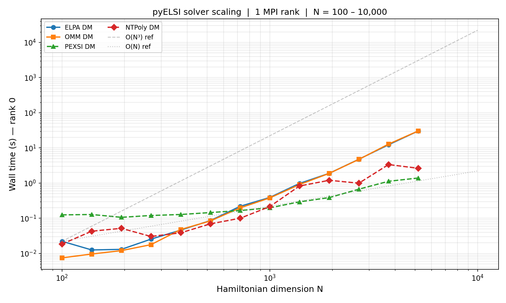
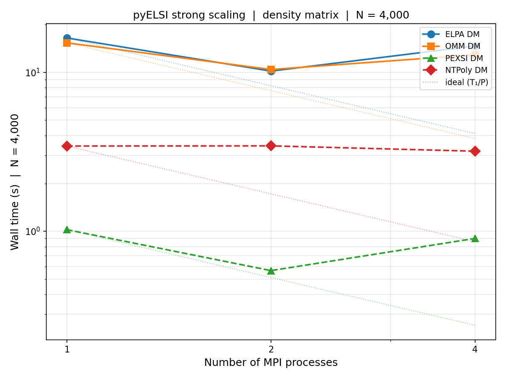

# pyELSI

`pyELSI` is a Python interface to [ELSI (ELectronic Structure Infrastructure)](https://wordpress.elsi-interchange.org/), a solver interface layer for eigenvalue and density-matrix computations in electronic structure workflows.

## Status (v0.1)
- **Linux x86_64-first**
- Default build is **CPU-only**
- MPI/GPU are **opt-in source builds** (intended for clusters)

## Solvers

`pyELSI` exposes solvers through `pyelsi.eigh(...)` and `pyelsi.density_matrix(...)`.

| Solver | `solver=` | Input format | `eigh` | `density_matrix` | MPI | Default build |
|--------|-----------|-------------|--------|-----------------|-----|---------------|
| **ELPA**      | `"elpa"`   | Dense real / complex | ✓ | ✓    | ✓ | ✓ |
| **libOMM**    | `"omm"`    | Dense real / complex | — | ✓    | ✓ | ✓ |
| **PEXSI**     | `"pexsi"`  | Sparse CSR (real)   | — | ✓    | ✓ | ✓ |
| **NTPoly**    | `"ntpoly"` | Sparse CSR (real)   | — | ✓    | ✓ | ✓ |
| **ChASE**     | `"chase"`  | Dense real           | ✓ | ⚠ ¹ | ✓ | ✓ |
| **SLEPc-SIP** | `"sips"`   | Sparse CSR (real)   | ✓ | ✓    | ✓ | opt-in |
| **MAGMA**     | `"magma"`  | Dense real / complex | ✓ | ✓    | ✓ | opt-in |
| **DLAF**      | `"dlaf"`   | Dense real / complex | ✓ | ✓    | ✓ | opt-in |

> ¹ **ChASE `density_matrix`**: technically supported via `eigh` internally, but not recommended.
> ChASE is designed for **extremal eigenpairs** — at most ~20% of the total spectrum.
> A density matrix requires the lowest `n_electrons ≈ n/2` eigenpairs (50% of the spectrum),
> which places the spectral cut-off in the middle of the spectrum where the Chebyshev filter has
> no leverage.  Use ELPA for dense density matrix calculations.

- **ELPA**: Massively parallel dense eigensolver using an efficient two-stage tridiagonalization.
- **libOMM**: Orbital minimization method — computes the density matrix directly without solving for eigenpairs.
- **PEXSI**: Fermi operator pole expansion; scales to 100,000+ MPI tasks for sparse Hamiltonians.
- **NTPoly**: Polynomial expansion of sparse matrix functions; achieves linear scaling for sufficiently sparse inputs.
- **ChASE**: Chebyshev Accelerated Subspace eigensolver — distributed dense partial-spectrum solver. Best suited for solving for the **lowest ~20% of eigenpairs** (extremal spectrum). Enabled by default.
- **SLEPc-SIP**: SLEPc shift-and-invert spectral transformation for sparse partial spectra. Requires SLEPc/PETSc; opt-in.
- **MAGMA**: GPU-accelerated dense eigensolver. Requires CUDA build (`-DPYELSI_ENABLE_CUDA=ON`).
- **DLAF**: DLA-Future distributed eigensolver. Requires separate DLA-Future library; opt-in.

## Install

### Python requirements

```bash
pip install pyELSI
```

Python 3.10+ is required.  Runtime dependencies (`numpy`, `scipy`) are installed
automatically.  Optional extras:

```bash
pip install "pyELSI[test,mpi]"   # adds pytest, matplotlib, mpi4py
```

### Build requirements (source / MPI builds)

Building from source (or enabling MPI/GPU) requires the following system
libraries.  These are the requirements inherited from ELSI itself:

| Requirement | Version | Notes |
|-------------|---------|-------|
| CMake | ≥ 3.6 | Build system |
| Fortran compiler | Fortran 2003 | e.g. `gfortran ≥ 7` or Intel `ifort` |
| C compiler | C99 | e.g. `gcc`, `clang`, `icc` |
| C++ compiler | C++11 | Optional; needed for pybind11 bindings |
| MPI | MPI-3 | e.g. OpenMPI ≥ 3 or MPICH ≥ 3; required for parallel builds |
| BLAS / LAPACK | — | e.g. OpenBLAS, MKL, or reference LAPACK |
| ScaLAPACK | — | Distributed linear algebra; required for MPI builds |
| CUDA | optional | For MAGMA GPU solver (`-DPYELSI_ENABLE_CUDA=ON`) |

Optional solver dependencies:

| Solver | Extra requirement |
|--------|------------------|
| SLEPc-SIP | SLEPc ≥ 3.18 + PETSc ≥ 3.18 (`-DPYELSI_ENABLE_SIPS=ON`) |
| MAGMA | CUDA toolkit + MAGMA library (`-DPYELSI_ENABLE_CUDA=ON`) |
| DLAF | DLA-Future library (`-DPYELSI_ENABLE_DLAF=ON`) |

**Conda environment (recommended for development and cluster installs):**

```bash
conda create -n pyelsi python=3.11 cmake fortran-compiler c-compiler cxx-compiler \
    openmpi openblas scalapack numpy scipy mpi4py matplotlib pytest \
    scikit-build-core pybind11
conda activate pyelsi
pip install -e ".[test,mpi]" --no-build-isolation
```

> **Why `--no-build-isolation`?**  Without it, pip creates an isolated build
> environment with its own Python, which may not find the conda environment's
> MPI headers and libraries.  With `--no-build-isolation`, pip uses the active
> conda environment directly — but this means the *build-system dependencies*
> (`scikit-build-core`, `pybind11`) must already be installed there, hence the
> extra packages in the `conda create` line above.

> **Stale CMake cache.**  If a previous build attempt failed, the `_skbuild/`
> directory in the project root may contain an incomplete CMake cache that will
> cause the same errors to repeat.  Delete it before retrying:
> ```bash
> rm -rf _skbuild
> pip install -e ".[test,mpi]" --no-build-isolation
> ```

> **HPC clusters — conflicting modules / BLAS.**  On clusters where multiple
> Python environments are loaded simultaneously (e.g. a PyTorch/CUDA module **and**
> the pyelsi conda env), CMake can pick up BLAS/LAPACK from the wrong environment
> — typically an incomplete MKL installation — leading to runtime errors like
> `Intel MKL FATAL ERROR: Cannot load libmkl_def.so.2`.
>
> pyELSI's build system automatically defaults to `BLA_VENDOR=OpenBLAS` when
> building inside a conda environment, and bakes the conda env's `lib/` directory
> into the module RPATH so runtime loading is correct.  If you still see MKL
> errors, ensure conflicting modules are unloaded **before** building and running:
> ```bash
> module purge                    # or selectively unload PyTorch / CUDA modules
> conda activate pyelsi
> rm -rf _skbuild
> pip install -e ".[test,mpi]" --no-build-isolation
> ```
> If you intentionally want to use MKL (e.g. on an Intel cluster), override the
> vendor:
> ```bash
> pip install -e ".[test,mpi]" --no-build-isolation \
>     --config-settings=cmake.define.BLA_VENDOR=Intel10_64lp
> ```

## Usage — serial

### Dense eigenvalue problem (ELPA)

```python
import numpy as np
import pyelsi

rng = np.random.default_rng(42)
n = 200

A = rng.standard_normal((n, n))
H = (A + A.T) / 2 + n * np.eye(n)   # symmetric, positive-definite

# All eigenvalues and eigenvectors
w, v = pyelsi.eigh(H, solver="elpa")
print(f"Lowest eigenvalue: {w[0]:.6f}")

# Eigenvalues only
w = pyelsi.eigh(H, solver="elpa", return_eigenvectors=False)
```

### Generalized eigenproblem (ELPA)

```python
import numpy as np
import pyelsi

rng = np.random.default_rng(0)
n = 100

A = rng.standard_normal((n, n))
H = (A + A.T) / 2

B = rng.standard_normal((n, n))
S = B @ B.T + 0.1 * np.eye(n)   # overlap matrix — must be SPD

w, v = pyelsi.eigh(H, S=S, solver="elpa")
```

### Dense density matrix — ELPA

```python
import numpy as np
import pyelsi

rng = np.random.default_rng(0)
n, ne = 200, 60     # 200 basis functions, 60 occupied states

A = rng.standard_normal((n, n))
H = (A + A.T) / 2 + n * np.eye(n)

D = pyelsi.density_matrix(H, n_electrons=ne, solver="elpa")
print(f"Tr(D) = {np.trace(D):.4f}  (expected {ne})")
```

### Dense density matrix — OMM

```python
import numpy as np
import pyelsi

rng = np.random.default_rng(1)
n, ne = 200, 60

A = rng.standard_normal((n, n))
H = (A + A.T) / 2 + n * np.eye(n)

D, energy = pyelsi.density_matrix(H, n_electrons=ne, solver="omm", return_energy=True)
print(f"Tr(D) = {np.trace(D):.4f}  band energy = {energy:.6f}")
```

### Sparse density matrix — PEXSI

```python
import numpy as np
import scipy.sparse
import pyelsi

rng = np.random.default_rng(2)
n, ne = 500, 100

# Sparse banded Hamiltonian
main = rng.standard_normal(n) + n
off  = 0.1 * rng.standard_normal(n - 1)
H = scipy.sparse.diags([main, off, off], [0, -1, 1], format="csr")

D = pyelsi.density_matrix(H, n_electrons=ne, solver="pexsi")
print(f"Tr(D) = {D.diagonal().sum():.4f}  (expected {ne})")
```

### Sparse density matrix — NTPoly

```python
import numpy as np
import scipy.sparse
import pyelsi

rng = np.random.default_rng(3)
n, ne = 500, 100

main = rng.standard_normal(n) + n
off  = 0.1 * rng.standard_normal(n - 1)
H = scipy.sparse.diags([main, off, off], [0, -1, 1], format="csr")

D = pyelsi.density_matrix(H, n_electrons=ne, solver="ntpoly")
print(f"Tr(D) = {D.diagonal().sum():.4f}  (expected {ne})")
```

### Sparse density matrix — SLEPc-SIP (SIPS)

When built with SLEPc, SIPS computes the sparse eigenproblem and forms the density matrix.

```python
import numpy as np
import scipy.sparse
import pyelsi

rng = np.random.default_rng(0)
n, ne = 500, 100

main = rng.standard_normal(n) + n
off  = 0.1 * rng.standard_normal(n - 1)
H = scipy.sparse.diags([main, off, off], [0, -1, 1], format="csr")

D = pyelsi.density_matrix(H, n_electrons=ne, solver="sips")
print(f"Tr(D) = {np.trace(D):.4f}  (expected {ne})")
```

### Dense partial eigenproblem — ChASE

ChASE computes the `n_state` lowest eigenpairs of a dense symmetric matrix
using a Chebyshev polynomial filter.  It is most efficient — and most
reliable — when `n_state` is a **small fraction of `n`** (≤ ~20% of the
spectrum).  The filter exploits the spectral gap between the last wanted
eigenvalue and the first unwanted one; that gap is large near the extremes of
the spectrum and vanishes at the midpoint, so requesting more than ~20% leads
to slow convergence or incorrect results.

```python
import numpy as np
import pyelsi

rng = np.random.default_rng(42)
n = 200
n_state = n // 5   # compute lowest 20% of spectrum — ChASE's efficient range

A = rng.standard_normal((n, n))
H = (A + A.T) / 2 + n * np.eye(n)

w, v = pyelsi.eigh(
    H, solver="chase",
    backend_opts={
        "n_state": n_state,
        "n_electron": float(n_state),
        # optional: Chebyshev filter degree (default 25), tolerance (default 1e-10),
        # and extra subspace fraction 0–0.5 (default 0.25 = 25% extra vectors)
        "chase_filter_deg": 25,
        "chase_tol": 1e-10,
        "chase_extra_space": 0.25,
    },
)
print(f"Lowest eigenvalue: {w[0]:.6f}")
print(f"Eigenvectors shape: {v.shape}")   # (n, n_state)
```

### Sparse partial eigenproblem — SLEPc-SIP (SIPS)

SLEPc-SIP solves sparse eigenproblems using a shift-and-invert spectral
transformation.  It requires the package to be built with
`-DPYELSI_ENABLE_SIPS=ON` and SLEPc/PETSc installed.

```python
import numpy as np
import scipy.sparse
import pyelsi

rng = np.random.default_rng(0)
n = 500
n_state = n // 4   # compute only the lowest quarter of the spectrum

main = rng.standard_normal(n) + n
off  = 0.1 * rng.standard_normal(n - 1)
H = scipy.sparse.diags([main, off, off], [0, -1, 1], format="csr")

w, v = pyelsi.eigh(
    H, solver="sips",
    backend_opts={
        "n_state": n_state,
        "n_electron": float(n_state),
        # eigenvalue interval is estimated automatically via Gershgorin bounds;
        # supply explicitly to override:
        # "sips_ev_min": -10.0,
        # "sips_ev_max": 100.0,
    },
)
print(f"Lowest eigenvalue: {w[0]:.6f}")
print(f"Eigenvectors shape: {v.shape}")   # (n, n_state)
```

> **Enabling SIPS:**  Install SLEPc/PETSc and rebuild:
> ```bash
> CMAKE_ARGS="-DPYELSI_ENABLE_SIPS=ON" pip install -v --no-build-isolation .
> ```

## Usage — MPI

Under `mpirun` each rank receives `force_single_proc=1` in `backend_opts` so
it uses its own private `MPI_COMM_SELF` context.  Results are gathered across
ranks to verify consistency.

### PEXSI with 4 MPI ranks

```python
# run as: mpirun -n 4 python pexsi_mpi.py
import numpy as np
import scipy.sparse
from mpi4py import MPI
import pyelsi

comm = MPI.COMM_WORLD
rank, size = comm.Get_rank(), comm.Get_size()

rng = np.random.default_rng(rank)     # each rank uses a different seed
n, ne = 500, 100

main = rng.standard_normal(n) + n
off  = 0.1 * rng.standard_normal(n - 1)
H = scipy.sparse.diags([main, off, off], [0, -1, 1], format="csr")

D = pyelsi.density_matrix(
    H, n_electrons=ne, solver="pexsi",
    backend_opts={"force_single_proc": 1},
)

if rank == 0:
    print(f"PEXSI DM Tr(D) = {D.diagonal().sum():.4f}  (expected {ne})")
```

### Running MPI tests

```bash
# smoke tests (build_info + ELPA + OMM + PEXSI + NTPoly)
mpirun -n 2 python -m pytest tests/test_mpi_smoke.py -v -s

# scaling benchmark with 2 MPI ranks
PYELSI_RUN_SCALING_BENCH=1 mpirun -n 2 python -m pytest tests/test_scaling_benchmark.py -v -s
```

## Build options

```bash
# MPI (on by default)
CMAKE_ARGS="-DPYELSI_ENABLE_MPI=ON" pip install -v .

# CUDA
CMAKE_ARGS="-DPYELSI_ENABLE_CUDA=ON" pip install -v .

# ChASE (on by default; disable to speed up compilation)
CMAKE_ARGS="-DPYELSI_ENABLE_CHASE=OFF" pip install -v .

# SLEPc-SIP (off by default; requires SLEPc + PETSc installed)
CMAKE_ARGS="-DPYELSI_ENABLE_SIPS=ON" pip install -v .
```

Query which optional solvers are compiled in at runtime:

```python
import pyelsi
info = pyelsi.build_info()
print(info)   # e.g. {'has_mpi': True, 'has_chase': True, 'has_sips': False, ...}
```

## ELSI sources

The build can either:
- **Fetch** a pinned ELSI tag from the upstream mirror (default), or
- **Use vendored** sources at `third_party/elsi/elsi-interface/`.

Vendored build:

```bash
CMAKE_ARGS="-DPYELSI_FETCH_ELSI=OFF" pip install -v .
```

Upstream repos:
- `https://gitlab.com/elsi_project`
- `https://gitlab.com/ElectronicStructureLibrary/elsi-interface`

## Docs

```bash
pip install -e ".[docs]"
mkdocs serve
```

## Tests (SciPy comparison)

```bash
pip install -e ".[test]"
pytest -q
```

The tests compare eigenvalues and density matrices against `scipy.linalg.eigh`.

MPI tests require `mpi4py`:

```bash
mpirun -n 2 python -m pytest tests/test_mpi_smoke.py -v -s
```

## Scaling

The scaling benchmark (`tests/test_scaling_benchmark.py`) times each solver
over 15 log-spaced matrix sizes from N = 100 to N = 10,000 and saves a plot to
`outputs/scaling_benchmark_{nprocs}proc.png`.

```bash
# Serial
PYELSI_RUN_SCALING_BENCH=1 python -m pytest tests/test_scaling_benchmark.py -v -s

# 4 MPI ranks (dense solvers use a 2×2 ScaLAPACK block-cyclic grid)
PYELSI_RUN_SCALING_BENCH=1 mpirun -n 4 python -m pytest tests/test_scaling_benchmark.py -v -s
```

### Expected complexity

Solvers not compiled in (e.g. SIPS without SLEPc) are silently omitted from the plot.

| Solver | Complexity | Input | Notes |
|--------|-----------|-------|-------|
| ELPA DM   | O(N³)      | Dense  | Diagonalization + DM construction |
| OMM DM    | O(N³)      | Dense  | Iterative; first call bootstraps via ELPA |
| ChASE eigh| O(N²·k)    | Dense  | k = n\_state (≤ ~20% of N); extremal eigenpairs only |
| PEXSI DM  | O(N^(d/2)) | Sparse | Pole expansion; d = system dimension |
| NTPoly DM | O(N)       | Sparse | Linear for sufficiently sparse matrices |
| SIPS eigh | O(N·k²)    | Sparse | k = n\_state; requires SLEPc |



### Strong scaling (fixed N=4000)

The strong-scaling benchmark (`tests/test_strong_scaling.py`) fixes N = 4,000
and measures wall time at 1, 2, and 4 MPI processes.  Run once per process
count; the combined plot is written automatically once ≥ 2 counts are present.

```bash
# Populate data for each process count, then view outputs/strong_scaling.png
PYELSI_RUN_SCALING_BENCH=1 python -m pytest tests/test_strong_scaling.py -v -s
PYELSI_RUN_SCALING_BENCH=1 mpirun -n 2 python -m pytest tests/test_strong_scaling.py -v -s
PYELSI_RUN_SCALING_BENCH=1 mpirun -n 4 python -m pytest tests/test_strong_scaling.py -v -s
```

Timings are cached in `outputs/strong_scaling_{P}proc.json` so individual
process counts can be re-run without re-timing the others.



---
This project credits and builds on [ELSI (ELectronic Structure Infrastructure)](https://wordpress.elsi-interchange.org/).

Not affiliated with the ELSI authors.
