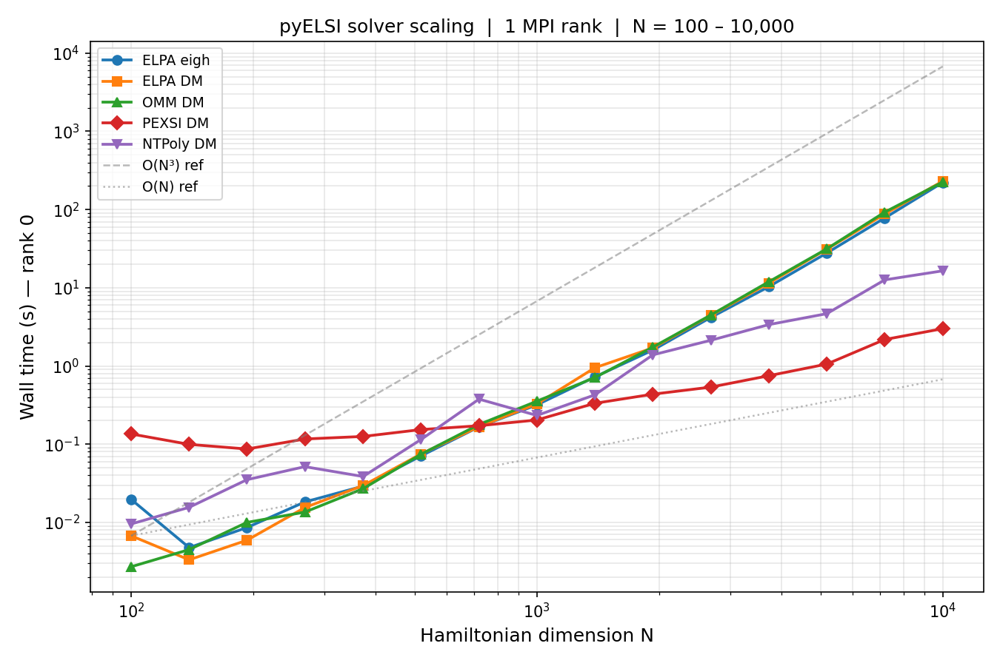

# pyELSI

`pyELSI` is a Python interface to [ELSI (ELectronic Structure Infrastructure)](https://wordpress.elsi-interchange.org/), a solver interface layer for eigenvalue and density-matrix computations in electronic structure workflows.

## Status (v0.1)
- **Linux x86_64-first**
- Default build is **CPU-only**
- MPI/GPU are **opt-in source builds** (intended for clusters)

## Solvers

`pyELSI` exposes four solvers through `pyelsi.eigh(...)` and `pyelsi.density_matrix(...)`.

| Solver | Input format | `eigh` | `density_matrix` | MPI |
|--------|-------------|--------|-----------------|-----|
| **ELPA**   | Dense real / complex | ✓ | ✓ | ✓ |
| **libOMM** | Dense real / complex | — | ✓ | ✓ |
| **PEXSI**  | Sparse real (CSR)   | — | ✓ | ✓ |
| **NTPoly** | Sparse real (CSR)   | — | ✓ | ✓ |

- **ELPA**: Massively parallel dense eigensolver using an efficient two-stage tridiagonalization.
- **libOMM**: Orbital minimization method — computes the density matrix directly without solving for eigenpairs.
- **PEXSI**: Fermi operator pole expansion; scales to 100,000+ MPI tasks for sparse Hamiltonians.
- **NTPoly**: Polynomial expansion of sparse matrix functions; achieves linear scaling for sufficiently sparse inputs.

## Install

```bash
pip install pyELSI
```

## Usage — serial

### Dense eigenvalue problem (ELPA)

```python
import numpy as np
import pyelsi

rng = np.random.default_rng(42)
n = 200

A = rng.standard_normal((n, n))
H = (A + A.T) / 2 + n * np.eye(n)   # symmetric, positive-definite

# All eigenvalues and eigenvectors
w, v = pyelsi.eigh(H, solver="elpa")
print(f"Lowest eigenvalue: {w[0]:.6f}")

# Eigenvalues only
w = pyelsi.eigh(H, solver="elpa", return_eigenvectors=False)
```

### Generalized eigenproblem (ELPA)

```python
import numpy as np
import pyelsi

rng = np.random.default_rng(0)
n = 100

A = rng.standard_normal((n, n))
H = (A + A.T) / 2

B = rng.standard_normal((n, n))
S = B @ B.T + 0.1 * np.eye(n)   # overlap matrix — must be SPD

w, v = pyelsi.eigh(H, S=S, solver="elpa")
```

### Dense density matrix — ELPA

```python
import numpy as np
import pyelsi

rng = np.random.default_rng(0)
n, ne = 200, 60     # 200 basis functions, 60 occupied states

A = rng.standard_normal((n, n))
H = (A + A.T) / 2 + n * np.eye(n)

D = pyelsi.density_matrix(H, n_electrons=ne, solver="elpa")
print(f"Tr(D) = {np.trace(D):.4f}  (expected {ne})")
```

### Dense density matrix — OMM

```python
import numpy as np
import pyelsi

rng = np.random.default_rng(1)
n, ne = 200, 60

A = rng.standard_normal((n, n))
H = (A + A.T) / 2 + n * np.eye(n)

D, energy = pyelsi.density_matrix(H, n_electrons=ne, solver="omm", return_energy=True)
print(f"Tr(D) = {np.trace(D):.4f}  band energy = {energy:.6f}")
```

### Sparse density matrix — PEXSI

```python
import numpy as np
import scipy.sparse
import pyelsi

rng = np.random.default_rng(2)
n, ne = 500, 100

# Sparse banded Hamiltonian
main = rng.standard_normal(n) + n
off  = 0.1 * rng.standard_normal(n - 1)
H = scipy.sparse.diags([main, off, off], [0, -1, 1], format="csr")

D = pyelsi.density_matrix(H, n_electrons=ne, solver="pexsi")
print(f"Tr(D) = {D.diagonal().sum():.4f}  (expected {ne})")
```

### Sparse density matrix — NTPoly

```python
import numpy as np
import scipy.sparse
import pyelsi

rng = np.random.default_rng(3)
n, ne = 500, 100

main = rng.standard_normal(n) + n
off  = 0.1 * rng.standard_normal(n - 1)
H = scipy.sparse.diags([main, off, off], [0, -1, 1], format="csr")

D = pyelsi.density_matrix(H, n_electrons=ne, solver="ntpoly")
print(f"Tr(D) = {D.diagonal().sum():.4f}  (expected {ne})")
```

## Usage — MPI

Under `mpirun` each rank receives `force_single_proc=1` in `backend_opts` so
it uses its own private `MPI_COMM_SELF` context.  Results are gathered across
ranks to verify consistency.

### PEXSI with 4 MPI ranks

```python
# run as: mpirun -n 4 python pexsi_mpi.py
import numpy as np
import scipy.sparse
from mpi4py import MPI
import pyelsi

comm = MPI.COMM_WORLD
rank, size = comm.Get_rank(), comm.Get_size()

rng = np.random.default_rng(rank)     # each rank uses a different seed
n, ne = 500, 100

main = rng.standard_normal(n) + n
off  = 0.1 * rng.standard_normal(n - 1)
H = scipy.sparse.diags([main, off, off], [0, -1, 1], format="csr")

D = pyelsi.density_matrix(
    H, n_electrons=ne, solver="pexsi",
    backend_opts={"force_single_proc": 1},
)

if rank == 0:
    print(f"PEXSI DM Tr(D) = {D.diagonal().sum():.4f}  (expected {ne})")
```

### Running MPI tests

```bash
# smoke tests (build_info + ELPA + OMM + PEXSI + NTPoly)
mpirun -n 2 python -m pytest tests/test_mpi_smoke.py -v -s

# scaling benchmark with 2 MPI ranks
PYELSI_RUN_SCALING_BENCH=1 mpirun -n 2 python -m pytest tests/test_scaling_benchmark.py -v -s
```

## Build options (MPI / CUDA)

```bash
# MPI
CMAKE_ARGS="-DPYELSI_ENABLE_MPI=ON" pip install -v .

# CUDA
CMAKE_ARGS="-DPYELSI_ENABLE_CUDA=ON" pip install -v .
```

## ELSI sources

The build can either:
- **Fetch** a pinned ELSI tag from the upstream mirror (default), or
- **Use vendored** sources at `third_party/elsi/elsi-interface/`.

Vendored build:

```bash
CMAKE_ARGS="-DPYELSI_FETCH_ELSI=OFF" pip install -v .
```

Upstream repos:
- `https://gitlab.com/elsi_project`
- `https://gitlab.com/ElectronicStructureLibrary/elsi-interface`

## Docs

```bash
pip install -e ".[docs]"
mkdocs serve
```

## Tests (SciPy comparison)

```bash
pip install -e ".[test]"
pytest -q
```

The tests compare eigenvalues and density matrices against `scipy.linalg.eigh`.

MPI tests require `mpi4py`:

```bash
mpirun -n 2 python -m pytest tests/test_mpi_smoke.py -v -s
```

## Scaling

The scaling benchmark (`tests/test_scaling_benchmark.py`) times each solver
over 15 log-spaced matrix sizes from N = 100 to N = 10,000 and saves a plot to
`outputs/scaling_nproc_{N}.png`.

```bash
# serial
PYELSI_RUN_SCALING_BENCH=1 pytest tests/test_scaling_benchmark.py -v -s

# 2 MPI ranks
PYELSI_RUN_SCALING_BENCH=1 mpirun -n 2 python -m pytest tests/test_scaling_benchmark.py -v -s

# 4 MPI ranks
PYELSI_RUN_SCALING_BENCH=1 mpirun -n 4 python -m pytest tests/test_scaling_benchmark.py -v -s
```

### Expected complexity (serial)

| Solver | Complexity | Notes |
|--------|-----------|-------|
| ELPA `eigh` | O(N³) | Dense two-stage tridiagonalization |
| ELPA DM | O(N³) | Diagonalization + density-matrix construction |
| OMM DM | O(N³) | Iterative; first call cold-starts via ELPA |
| PEXSI DM | O(N^(d/2)) | sparse input; d= dimension of system |
| NTPoly DM | O(N) | Linear for sufficiently sparse matrices |



---
This project credits and builds on [ELSI (ELectronic Structure Infrastructure)](https://wordpress.elsi-interchange.org/).

Not affiliated with the ELSI authors.
